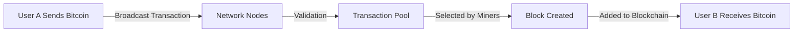
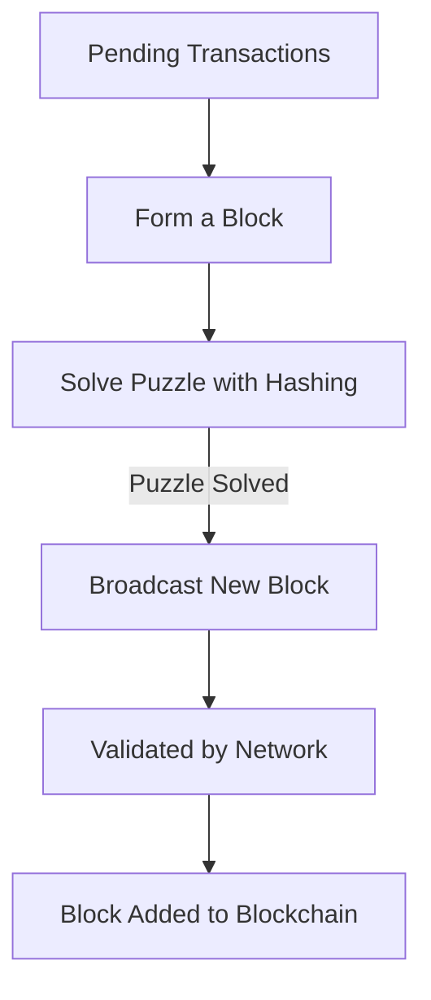
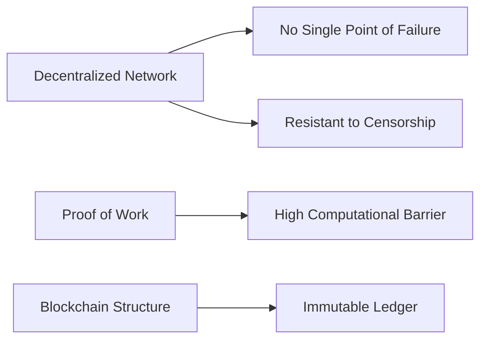

# Vulkan Cryptocurrency

## Overview

Vulkan is a robust and high-performance cryptocurrency blockchain designed to ensure efficiency and scalability. Unlike many existing blockchains, Vulkan focuses on lightweight performance and adaptability, making it an ideal choice for diverse applications, from enterprise-level systems to embedded devices. Written entirely from scratch in C++, Vulkan takes advantage of Cython to provide Python bindings, making it a versatile and portable solution. Vulkan supports a wide array of platforms, including macOS, Windows, Android, and even embedded systems. By leveraging RocksDB/LevelDB for efficient storage, Vulkan minimizes RAM usage and optimizes disk space utilization for better performance.

## Features

- **Lightweight and Fast:** Designed for optimal speed and minimal resource usage.
- **Cross-Platform Compatibility:** Supports macOS, Windows, Android, and embedded systems.
- **Efficient Storage:** Utilizes RocksDB/LevelDB for optimized blockchain data storage.
- **Advanced Security:** Implements SHA256 Proof of Work (PoW), with plans for Proof of Activity (PoA) in future updates.
- **Scalability:** Vulkan’s design enables efficient scaling to support a growing number of transactions and users.
- **Customizable:** Developers can easily fork and customize Vulkan for specific use cases.
- **Energy Efficient:** Future implementations aim to optimize energy consumption while maintaining security.

## Current Implementations

- **SHA256 Proof of Work (PoW):** Vulkan employs the same SHA256-based PoW mechanism as Bitcoin to secure its network.
- **Future-Proofing with Proof of Activity (PoA):** Vulkan aims to adopt PoA to improve security and incentivize participation.

## Key Technical Highlights from Vulkan Source Code

### Compression and Storage Options
Vulkan supports both RocksDB and LevelDB for efficient data storage. Developers can choose RocksDB for high write throughput or LevelDB for simplicity and smaller memory footprints, depending on the use case. It provides customizable compression options, including:
- **Snappy Compression**
- **LZ4 Compression**
- **Zstandard Compression**

Developers can toggle compression using `set_want_blockchain_compression()` and set specific compression algorithms with `set_blockchain_compression_type()`.

### Genesis Block Initialization
During blockchain initialization, Vulkan validates and inserts the genesis block. This ensures a solid foundation for the blockchain, whether operating in mainnet or testnet mode.

### Block and Transaction Validation
Vulkan employs rigorous validation checks, including:
- **Timestamp Validation:** Ensures blocks are not timestamped too far in the future.
- **Merkle Root Verification:** Confirms transaction integrity within a block.
- **Proof-of-Work Checks:** Verifies that blocks meet the required difficulty.

### Blockchain Database Management
Vulkan offers comprehensive tools for managing blockchain data:
- **Database Repair:** Functions like `repair_blockchain()` fix corrupted databases.
- **Backup and Restore:** Backup functionality is implemented with `backup_blockchain()` and `restore_blockchain()`.
- **Rollback Mechanism:** The blockchain can rollback to a specific height using `rollback_blockchain()`.

### Mining and Difficulty Adjustment
Vulkan dynamically adjusts mining difficulty based on block production times, ensuring stable block intervals even during fluctuations in network activity. For example, in periods of increased miner participation, difficulty rises to maintain balance. This ensures consistent block generation, using functions like `get_next_work_required()` to calculate difficulty.

### Merkle Tree Implementation
Transactions are organized into Merkle trees, with the root hash stored in each block. This provides a fast and efficient way to verify transaction integrity.

## Peer-to-Peer Communication Protocol

Vulkan’s P2P communication protocol manages the interactions between nodes on the network, ensuring a secure and efficient decentralized system. For instance, during blockchain synchronization, nodes utilize grouped synchronization to transfer multiple blocks simultaneously, reducing latency.

### Packet Structure
- **Packets:** Serialized structures containing:
  - `id`: Packet type identifier.
  - `size`: Payload size.
  - `data`: Payload data.
- Serialization and deserialization are handled by `serialize_packet()` and `deserialize_packet()` functions.

### Packet Types
- **Peer Management:**
  - `PKT_TYPE_CONNECT_ESTABLISH_REQ` and `PKT_TYPE_CONNECT_ESTABLISH_RESP` for establishing peer connections.
  - `PKT_TYPE_GET_PEERLIST_REQ` and `PKT_TYPE_GET_PEERLIST_RESP` for managing the network’s peer list.
- **Blockchain Synchronization:**
  - `PKT_TYPE_GET_BLOCK_HEIGHT_REQ` and `PKT_TYPE_GET_BLOCK_HEIGHT_RESP` for blockchain height synchronization.
  - `PKT_TYPE_GET_BLOCK_BY_HASH_REQ`, `PKT_TYPE_GET_BLOCK_BY_HEIGHT_REQ`, and their respective responses for fetching specific blocks.
- **Transaction Propagation:**
  - `PKT_TYPE_INCOMING_MEMPOOL_TRANSACTION` for broadcasting new transactions to the mempool.

### Message Handling
- **Processing Messages:**
  - `handle_packet()` and `handle_packet_sendto()` manage routing and processing of incoming/outgoing packets.
  - Ensures anonymous connections and version compatibility with enforced checks.
- **Serialization:**
  - `serialize_message()` packages messages for transmission.
  - `deserialize_message()` decodes received packets into actionable messages.

### Synchronization Features
- **Sync Requests:** Initiates synchronization based on block height and ensures backup integrity with `init_sync_request()`.
- **Backup and Rollback:** Uses `backup_blockchain_and_rollback()` to ensure blockchain consistency during synchronization.
- **Grouped Synchronization:** Efficiently synchronizes multiple blocks at once to minimize delays.

### Error Handling
Robust error-checking mechanisms handle issues such as corrupted packets, invalid transactions, or failed connections.

## Installation Guide

### Dependencies

Vulkan includes submodules in the `external` directory for required dependencies. Precompiled dependencies can be used for faster setup.

#### Windows

Detailed setup instructions will be provided soon.

#### macOS

Install the necessary packages using Homebrew:

```bash
brew install leveldb
brew install rocksdb
brew install libsodium
brew install json-c
```

#### Linux

Install the required dependencies using `apt-get`:

```bash
sudo apt-get install librocksdb-dev
sudo apt-get install libsodium-dev
sudo apt-get install libjson-c-dev
```

## Compilation Instructions

Once dependencies are installed, compile the Vulkan daemon using CMake.

### Windows

```bash
git clone https://github.com/vulkancurrency/vulkan.git
cd vulkan
git submodule update --init --recursive
mkdir build
cd build
cmake -G "Visual Studio 14 Win64" ..
```

### macOS & Linux

```bash
git clone https://github.com/vulkancurrency/vulkan.git
cd vulkan
git submodule update --init --recursive
mkdir build
cd build
cmake .. && make -j 4
```

### ARM MacBook

For ARM-based MacBooks, run:

```bash
arch -x86_64 /usr/local/bin/cmake ..
make -j <NUMBER_OF_THREADS>
```

## Forking Guide

Vulkan encourages forking to foster innovation and improve the blockchain.

### Steps to Fork

1. **Update `parameters.h`:** Modify definitions for testnet or mainnet configurations.
2. **Recompile:** Build the Vulkan daemon and generate a genesis block.
3. **Adjust Configurations:** Update the genesis block details in the configuration files.

### Example Testnet Genesis Block

```plaintext
Block:
Version: 1
Previous Hash: 0000000000000000000000000000000000000000000000000000000000000000
Hash: 00000000ca2796715a7515bf51295cce6715d6a6dfafe67effab4e2a7798423f
...
```

## How Bitcoin Works

Bitcoin is the foundational cryptocurrency that inspired Vulkan’s development. By understanding Bitcoin’s architecture and limitations, Vulkan was designed to enhance scalability, provide customizable features, and reduce resource consumption. Below is an in-depth explanation of how Bitcoin works.

### Overview

Bitcoin operates on a decentralized, peer-to-peer network. Transactions are verified by miners and recorded on a public ledger called the blockchain. Bitcoin’s architecture eliminates the need for central authorities, making it trustless and secure.

### Key Components

1. **Blockchain:** A distributed ledger that records all transactions.
2. **Nodes:** Computers that participate in the network, maintaining and validating the blockchain.
3. **Miners:** Nodes that solve cryptographic puzzles to add new blocks to the blockchain.
4. **Wallets:** Digital tools that store users’ private and public keys, enabling them to send and receive Bitcoin.
5. **Transactions:** Transfers of Bitcoin between users, verified and added to blocks by miners.
6. **Consensus Mechanism:** The network’s consensus ensures that all nodes agree on the current state of the blockchain.

### Transaction Process



### Mining Process

Mining involves solving a computationally intensive problem called a proof of work. This ensures the network’s security and prevents malicious actors from altering the blockchain.

#### Steps in Mining



### Security Features of Bitcoin



### Applications of Bitcoin

Bitcoin has a wide range of applications, including:

1. **Digital Payments:** Facilitating peer-to-peer transactions globally.
2. **Store of Value:** Often referred to as "digital gold," Bitcoin is used as a hedge against inflation.
3. **Smart Contracts:** Limited capabilities through Layer 2 solutions like Lightning Network.
4. **Decentralized Finance (DeFi):** Enabling financial services without intermediaries.

## License

Vulkan is released under the MIT License. Refer to the LICENSE file for detailed information.
